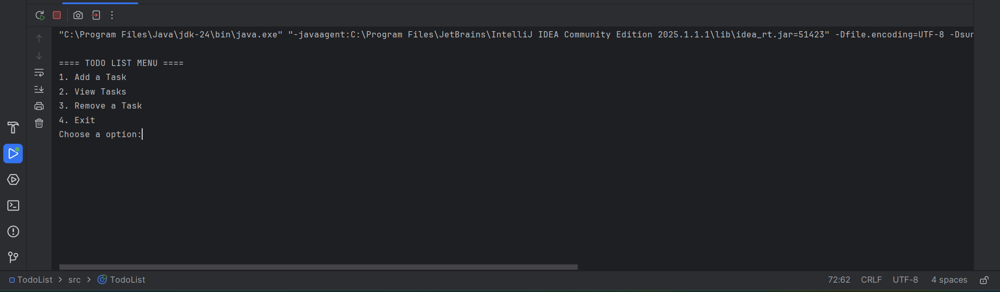

# 📋 Todo List (Java CLI App)

> A simple console-based Todo List application written in Java.  
> Users can:
> - Add tasks  
> - View all tasks  
> - Remove tasks  
> - Exit the program  

The app uses basic Java features like `ArrayList`, `Scanner`, `switch` statements, and user input handling.

 

---

## 📌 Features  

✅ Add a new task  
✅ View all tasks  
✅ Remove a task by selecting its number  
✅ Runs in a loop until the user chooses to exit  
✅ Input validation and error handling  

---

## 🧠 Concepts Practiced

- Java `ArrayList` and `List` interface  
- Exception handling with `try-catch`  
- Using `Scanner` for user input  
- Working with loops and conditionals  
- Use of methods for clean structure  

---

## 📈 Future Improvements  

🔹 Mark tasks as completed  
🔹 Edit a task  
🔹 Save/load tasks to a file using I/O  
🔹 Add due dates or priorities  

---

## 🧾 How to Run

### ✅ Prerequisites

- Java JDK 8 or higher  
- Terminal / Command Prompt or an IDE (e.g., IntelliJ, VS Code)

---

### 🧵 Option 1: Run via Terminal

#### Step 1: Download the Java File

- Download `TodoList.java` from the `src` folder of this repository.
- Save it into a folder on your computer.

#### Step 2: Open Terminal in That Folder

Navigate to the folder where `TodoList.java` is saved:

```bash
cd path/to/your/folder
```

#### Step 3: Compile the Java File
```bash
javac TodoList.java
```

#### Step 4: Run the File
```bash
java TodoList.java
```

### 💡 Option 2: Run in an IDE (e.g., IntelliJ IDEA or VS Code)

#### Step 1: Clone or Download the Repository

If you use Git, run:

```bash
git clone https://github.com/your-username/todo-list-java.git
cd todo-list-java
```

Or download the `TodoList.java` file manually and open it in your IDE

#### Step 2: Open the Project/File in Your IDE
- Open the folder containing `TodoList.java`
- Ensure the Java SDK is configured properly.

#### Step 3: Run the Application
- In IntelliJ, right-click the `TodoList.java` file.
- Select Run `TodoList.main()`.
- The app will run in the IDE's terminal or console.


 
